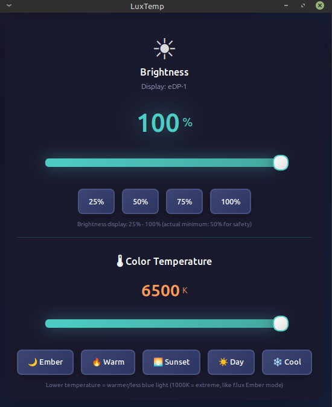

# LuxTemp - Brightness & Color Temperature Control

A beautiful, modern brightness and color temperature control application for Linux with a stunning dark theme interface. Features f.lux-like blue light reduction, system tray integration, and responsive design for all screen sizes.




## ✨ Features

### Core Features
- 🎨 **Modern Dark Theme UI** - Beautiful gradient-based interface with smooth animations
- 📱 **Responsive Design** - Works perfectly on all screen resolutions (1366x768 to 4K+)
- 🖼️ **Custom Logo** - Beautiful SVG icon with sun and color temperature indicators
- 🖥️ **Multiple Display Support** - Works with both xrandr and backlight interfaces
- 🎚️ **Compact Sliders** - Constrained width sliders that stay centered when maximized
- 🚀 **Lightweight** - Minimal resource usage, perfect for any desktop environment

### Brightness Control
- 🎚️ **Smart Slider** - Display shows 25-100% (actual: 50-100% for safety)
- ⚡ **Quick Presets** - One-click buttons for 25%, 50%, 75%, and 100%
- 🔒 **Safe Minimum** - Prevents screen from being too dark (50% actual minimum)
- ⚡ **Real-time Updates** - Changes apply immediately as you adjust

### Color Temperature Control (f.lux-like)
- 🌡️ **Blue Light Filter** - Reduce blue light like f.lux (1000K-6500K)
- 🔥 **Temperature Presets** - Ember (1000K), Warm (2700K), Sunset (4000K), Day (5500K), Cool (6500K)
- 🌙 **Ember Mode** - Extreme warm mode at 1000K (like f.lux Ember) for maximum blue light reduction
- 👁️ **Eye Comfort** - Reduces eye strain during extended use

### System Tray Integration
- 📍 **System Tray Icon** - Lives in the notification area (lower right corner)
- 🖱️ **Right-Click Menu** - Quick access to brightness and temperature presets
- 🔄 **Minimize to Tray** - Closing window hides app instead of quitting
- 🚀 **Autostart Support** - Can start automatically on login
- ⚡ **Quick Adjustments** - Change settings without opening the main window

## 🎨 Interface

The application features:
- **Custom SVG Logo** - Beautiful sun icon with color temperature indicator
- **Gradient Dark Background** - Deep blue tones (#1a1a2e to #16213e)
- **Cyan Accent** - Brightness controls with glowing cyan (#4ecdc4)
- **Orange Accent** - Temperature controls with warm orange (#ff9a56)
- **Compact Design** - Optimized for small screens (420x500 default size)
- **Responsive Layout** - Sliders stay centered when window is maximized
- **Modern Sliders** - Smaller, sleeker sliders with smooth animations
- **Preset Buttons** - Quick access buttons for common settings
- **Display Information** - Shows your active monitor name
- **Separate Sections** - Clear division between brightness and temperature controls

## 📋 Requirements

### Required
- Linux (any distribution)
- Python 3.6 or higher
- GTK 3.0
- PyGObject (python3-gi)
- xrandr (usually pre-installed)

### Optional (for System Tray)
- AppIndicator3 (gir1.2-appindicator3-0.1)
- Desktop environment that supports system tray indicators

### Supported Desktop Environments
- XFCE (with xfce4-indicator-plugin)
- GNOME (with TopIcons Plus extension)
- KDE Plasma
- MATE
- Cinnamon
- Ubuntu Unity

## Installation

### Quick Install

1. Clone or download this repository
2. Navigate to the directory
3. Run the installation script:

```bash
chmod +x install.sh
./install.sh
```

The installer will:
- ✅ Check and install required dependencies (GTK, PyGObject)
- ✅ Install system tray support (AppIndicator3)
- ✅ Install custom application icon
- ✅ Copy application files to `/opt/brightness-control`
- ✅ Create a launcher in `/usr/local/bin`
- ✅ Add a desktop entry to your application menu
- ✅ Set up backlight permissions (if applicable)
- ✅ Update icon and desktop database

### Manual Installation

If you prefer manual installation:

```bash
# Install dependencies
sudo apt install python3-gi python3-gi-cairo gir1.2-gtk-3.0

# Install system tray support (optional)
sudo apt install gir1.2-appindicator3-0.1

# Make the script executable
chmod +x luxtemp.py

# Run directly
./luxtemp.py
```

## 🚀 Usage

### Launch the Application

After installation, you can launch the application in multiple ways:

#### Normal Mode (Window Visible)
```bash
# From application menu
Search for "LuxTemp" in your application menu

# From terminal
luxtemp

# Direct run
python3 luxtemp.py
```

#### System Tray Mode (Start Hidden)
```bash
# Start in system tray
luxtemp --tray

# Alternative
luxtemp --hidden
```

### System Tray Features

When running in system tray mode:
- 🖱️ **Right-click the tray icon** to access quick menu
- 📋 **Menu Options**:
  - Show/Hide Window
  - Brightness presets (25%, 50%, 75%, 100%)
  - Temperature presets (Ember 1000K, Warm, Sunset, Day, Cool)
  - Quit (resets to defaults: 100% brightness, 6500K)
- ❌ **Close button** minimizes to tray (doesn't quit)
- 🔄 **Toggle window** from tray menu
- 🔄 **Auto-reset**: Quitting the app resets brightness to 100% and temperature to 6500K

### Autostart on Login

To start the app automatically in system tray:

```bash
# Copy autostart file
mkdir -p ~/.config/autostart
cp brightness-control-autostart.desktop ~/.config/autostart/
```

The app will now start in the system tray every time you log in!

### Adjusting Brightness

- **Display Range**: Shows 25% to 100% (intuitive numbering)
- **Actual Range**: 50% to 100% (prevents screen from being too dark)
- **Slider**: Drag to adjust brightness smoothly
- **Preset Buttons**: Click 25%, 50%, 75%, or 100% for quick adjustments
- **Real-time Updates**: Changes apply immediately
- **From Tray**: Right-click tray icon → Brightness → Select preset

### Adjusting Color Temperature (Blue Light Filter)

- **Temperature Range**: 1000K (extreme warm) to 6500K (neutral)
- **Temperature Slider**: Drag to adjust color warmth
- **Temperature Presets**:
  - 🌙 **Ember (1000K)**: Extreme warm mode, maximum blue light reduction (like f.lux Ember)
  - 🔥 **Warm (2700K)**: Very warm, great for late night reading
  - 🌅 **Sunset (4000K)**: Moderate warmth (good for evening)
  - ☀️ **Day (5500K)**: Slightly warm (comfortable for daytime)
  - ❄️ **Cool (6500K)**: Neutral white, no filtering (normal daylight)
- **Real-time Updates**: Color changes apply immediately
- **Eye Comfort**: Lower temperatures reduce blue light, reducing eye strain
- **From Tray**: Right-click tray icon → Color Temperature → Select preset
- **Warning**: 1000K is very orange/red - use for extreme situations only

**Note**: Color temperature control requires xrandr and may not work with all backlight-only systems.

### Window Behavior

- **Resizable**: Window can be resized and maximized
- **Sliders Stay Centered**: When maximized, sliders maintain 400px width and stay centered
- **Compact Design**: Optimized for small screens (1366x768+)
- **No Scrolling**: All content fits in the window

## How It Works

### Brightness Control

The application uses two methods to control brightness:

1. **xrandr** (Primary): Works with most displays using the X11 display server
2. **Backlight Interface** (Fallback): Direct hardware control via `/sys/class/backlight`

### Color Temperature Control

Uses xrandr's gamma adjustment feature to shift the color balance:
- Lower temperatures (warm) reduce blue and green output
- Higher temperatures (cool) maintain neutral white balance
- Similar to f.lux, Redshift, or Night Light features

The app automatically detects which method to use based on your system configuration.

## Permissions

For backlight control, the application may need special permissions. The installer automatically:
- Creates udev rules for backlight access
- Adds your user to the `video` group
- Configures proper file permissions

**Note**: You may need to log out and log back in after installation for permissions to take effect.

## Troubleshooting

### Brightness doesn't change

1. **Log out and log back in** - Required after first installation for permissions
2. **Check display detection**:
   ```bash
   xrandr --verbose | grep -i brightness
   ```
3. **Verify backlight access**:
   ```bash
   ls -l /sys/class/backlight/*/brightness
   ```

### Application doesn't start

1. **Check dependencies**:
   ```bash
   python3 -c "import gi; gi.require_version('Gtk', '3.0'); from gi.repository import Gtk"
   ```
2. **Run from terminal** to see error messages:
   ```bash
   python3 luxtemp.py
   ```

### Permission denied errors

Run the installer again or manually set up permissions:
```bash
sudo usermod -a -G video $USER
# Then log out and log back in
```

## Uninstallation

To remove the application:

```bash
chmod +x uninstall.sh
./uninstall.sh
```

This will remove all installed files and optionally remove the udev rules.

## 🔧 Technical Details

- **Language**: Python 3
- **GUI Framework**: GTK 3.0 (PyGObject)
- **System Tray**: AppIndicator3
- **Display Control**: xrandr / sysfs backlight interface
- **Color Temperature**: xrandr gamma adjustment
- **Styling**: Custom CSS with modern gradients and shadows
- **Theme**: Dark gradient theme with dual accent colors
  - Cyan (#4ecdc4) for brightness controls
  - Orange (#ff9a56) for temperature controls
- **Window Size**: 420x500 (default), 380x420 (minimum)
- **Slider Width**: Constrained to 400px max (stays centered when maximized)
- **Icon Format**: SVG (scalable vector graphics)

## Customization

You can customize the appearance by editing the CSS in `luxtemp.py`. Look for the `apply_dark_theme()` method to modify:
- Colors and gradients
- Font sizes
- Spacing and padding
- Animations and shadows

## Contributing

Contributions are welcome! Feel free to:
- Report bugs
- Suggest new features
- Submit pull requests
- Improve documentation

## License

This project is open source and available under the MIT License.

## 📚 Documentation

Additional documentation files:
- **CHANGES.md** - Detailed changelog of all updates
- **FEATURES.md** - Complete feature guide with examples
- **RESPONSIVE_DESIGN.md** - Screen compatibility information
- **SYSTEM_TRAY_GUIDE.md** - System tray setup and usage guide

## 📝 Command Reference

```bash
# Launch with window visible
luxtemp

# Launch in system tray (hidden)
luxtemp --tray
luxtemp --hidden

# Enable autostart
mkdir -p ~/.config/autostart
cp brightness-control-autostart.desktop ~/.config/autostart/

# Disable autostart
rm ~/.config/autostart/brightness-control-autostart.desktop

# Run from source
python3 luxtemp.py
python3 luxtemp.py --tray

# Reinstall
./install.sh

# Uninstall
./uninstall.sh
```

## 🎯 Quick Tips

1. **For Extreme Night Use**: Set brightness to 25% and temperature to Ember (1000K) - very orange!
2. **For Night Reading**: Brightness 25-50% with Warm (2700K)
3. **For Evening**: Medium brightness (50-75%) with Sunset (4000K)
4. **For Daytime**: Higher brightness (75-100%) with Cool (6500K)
5. **Autostart**: Enable autostart to have the app always available in system tray
6. **Maximize Window**: Sliders stay centered and don't stretch too wide
7. **System Tray**: Right-click the tray icon for quick access to presets
8. **Close Button**: Minimizes to tray instead of quitting (use Quit from menu to exit)
9. **Ember Warning**: 1000K is extremely warm - everything looks orange/red (like candlelight)

## 🆕 What's New in Version 2.0

- ✨ Color temperature control (f.lux-like blue light reduction)
- 📍 System tray integration with quick access menu
- 🖼️ Custom SVG logo and application icon
- 📱 Responsive design for all screen resolutions
- 🎚️ Smart brightness display (25-100% shown, 50-100% actual)
- 🎯 Constrained sliders that stay centered when maximized
- 🚀 Autostart support for system tray
- 🎨 Compact, modern UI with dual accent colors
- ⚡ Quick preset buttons for both brightness and temperature
- 🔄 Minimize to tray instead of quit

## Credits

Created for Linux users who want a beautiful, modern brightness and color temperature control tool with system tray integration.

---

**Enjoy your new brightness control app! ☀️🌡️**

*Star this repo if you find it useful!*
